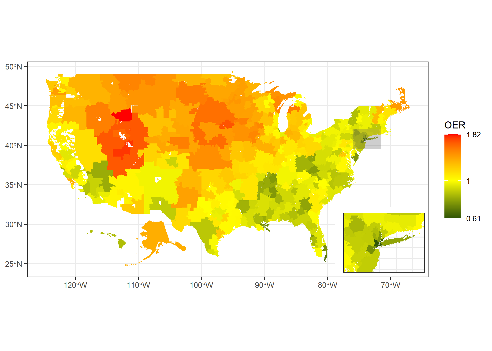

Regional variations in rates of total knee arthroplasty among Medicare
beneficiaries
================
Michael M Ward and Abhijit Dasgupta

<!-- README.md is generated from README.Rmd. Please edit that file -->

<!-- badges: start -->

<!-- badges: end -->

This repository contains R code for some analyses and figure generation
for our paper looking at regional variations in the rates of total knee
arthroplasty across the United States among Medicare beneficiaries.

The paper is now published:

Ward, M. M., & Dasgupta, A. (2020). Regional Variation in Rates of Total
Knee Arthroplasty Among Medicare Beneficiaries. JAMA network open,
**3(4)**, e203717.
[link](https://doi.org/10.1001/jamanetworkopen.2020.3717)

<!-- -->
